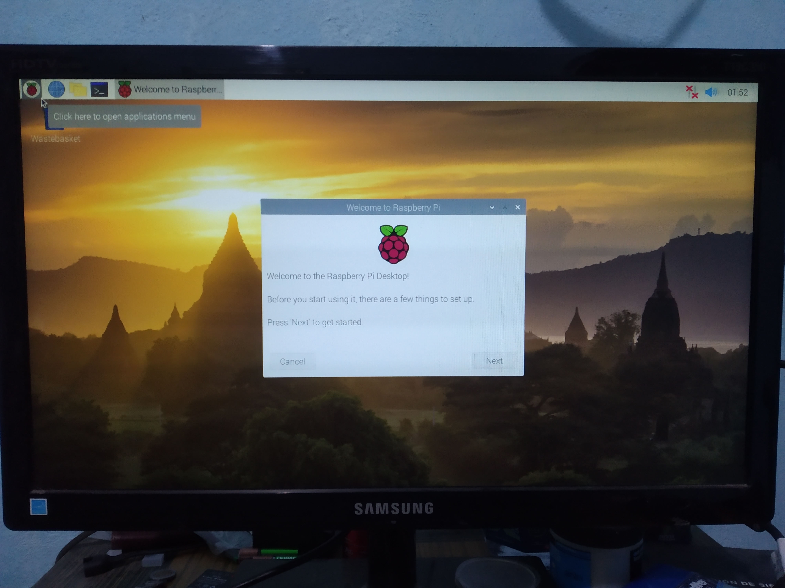
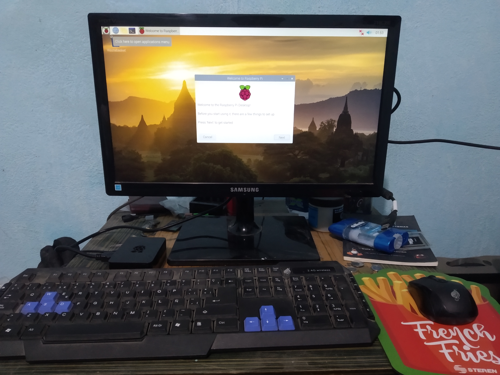
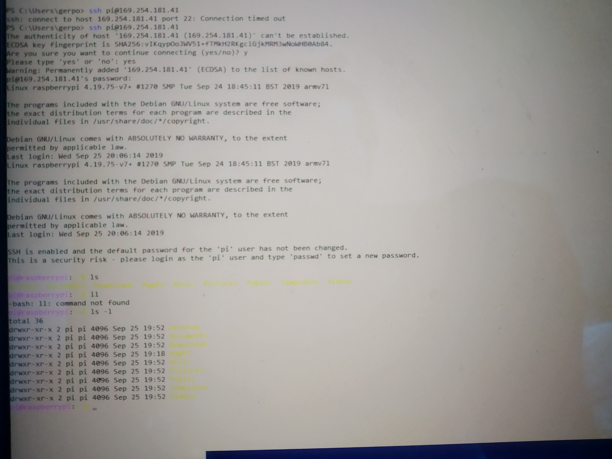
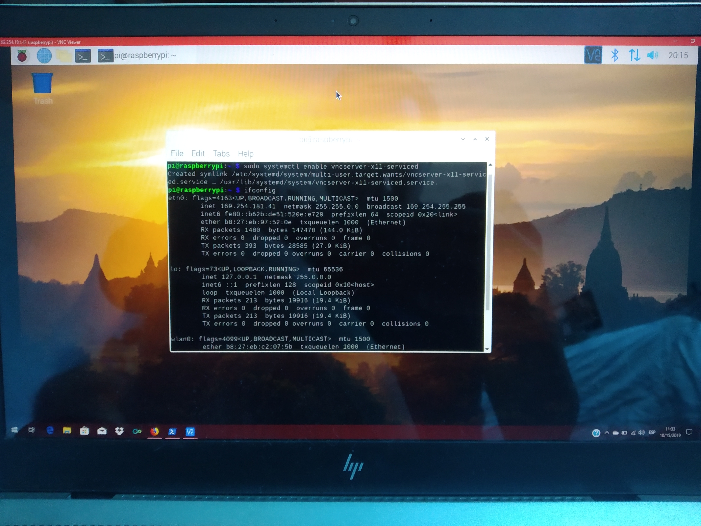
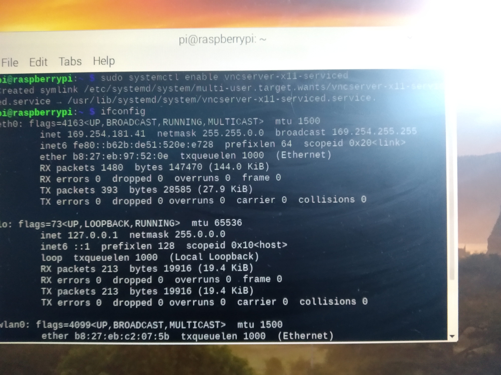

# Escuela Superior de Cómputo #
# Instituto Politécnico Nacional #
### 3CM1 ###
### Embedded Systems ### 
#### Configuración básica de raspberry y tipos de comunicación con otros dispositivos. ####
---
## Índice ##
* Uso de Raspberry como Pc
* Conexión por SSH
* Conexión por VNC 
* Conexón por Consola
* Integrantes del equipo
---
## Uso de Raspberry como Pc ##
La imágen 1 muestra el inicio de Raspberry y su bienvenida.
>Imágen 1

La imágen 2 muestra el uso de las raspberry como un Pc.
>Imágen 2

***
## Conexión por SSH ##
La imágen 3 muestra la conexión usando ssh desde el powershell de Windows.

>Imágen 3

La imágen 4 muestra la conexión usando ssh desde powershell de Windows con otro color, para buscar que se noten bien las letras.

>Imágen 4

---
## Conexión por VNC ##
La imágen 5 muestra la interfaz de Raspbian en una computadora ocupando Windows 10.

>Imágen 5

La imágen 6 muestra la interfaz de Raspbian, mostrando que es la misma a la de la imagen 5 y que la conexión VNC se ha realizado correctamente.

>Imágen 6

---
## Conexión por Consola por medio de UART##

La imágen 7 muestra la conexión entre la raspberry y la Pc usando el módulo FT323 para hacer a conexión por UART de manera física.

La imágen 8 muestra la conexión entre la raspberry y la Pc por UART y muestra la consola de la Pc y la raspberry encendida.

La imágen 9 muestra la conexión entre la raspberry y la Pc realizada exitosamente y se accedió a la raspberry usando el módulo FT232 que ya se pueden aplicar los comandos sobre raspbian.

---
## Integrantes del Equipo 8 ##
#### Añorve Pons Germán Silvestre ####
#### Chaves Cortes Miguel Ángel Ivan ####